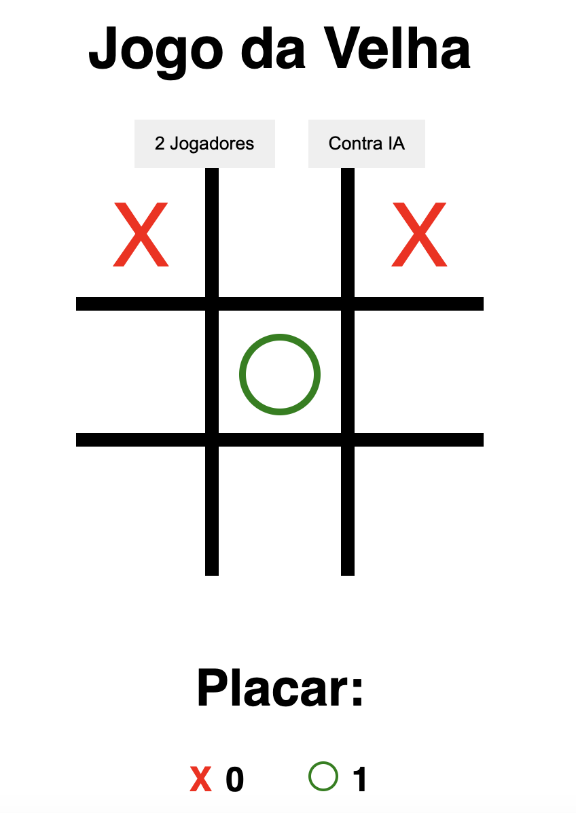

# Jogo da Velha em JavaScript Vanilla

Este é um simples jogo da velha desenvolvido em JavaScript Vanilla. O jogo é jogado em um tabuleiro 3x3 e pode ser jogado por dois jogadores alternadamente.

## Como jogar

1. Abra o arquivo `index.html` no seu navegador preferido.
2. O tabuleiro do jogo da velha será exibido na tela.
3. O jogador 1 (X) começa jogando. Clique em uma célula vazia para marcar com o símbolo "X".
4. O jogador 2 (O) fará o próximo movimento, clique em outra célula vazia para marcar com o símbolo "O".
5. Os jogadores continuam alternando até que um dos jogadores vença ou ocorra um empate.
6. O jogo pode ser reiniciado a qualquer momento clicando no botão "Reiniciar Jogo".

## Regras do Jogo

1. O objetivo do jogo é conseguir três símbolos iguais em uma linha, coluna ou diagonal do tabuleiro.
2. Se um jogador conseguir colocar três símbolos em uma linha, coluna ou diagonal, ele vence o jogo.
3. Se todas as células do tabuleiro forem preenchidas e nenhum jogador conseguir três símbolos iguais em sequência, o jogo termina em empate.

## Recursos Utilizados

- HTML5
- CSS3
- JavaScript (Vanilla)

## Screenshot

## Sobre

Este jogo da velha em JavaScript Vanilla foi desenvolvido como um projeto simples para praticar e demonstrar habilidades de programação front-end. Sinta-se à vontade para utilizar, modificar e distribuir este código conforme necessário.

## Contato

Se você tiver alguma dúvida, sugestão ou feedback, sinta-se à vontade para me contatar pelo e-mail: jeanpaulwebb@gmail.com

Divirta-se jogando! 😄🎮
